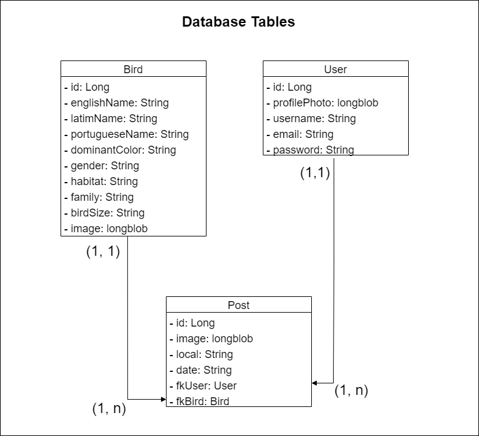
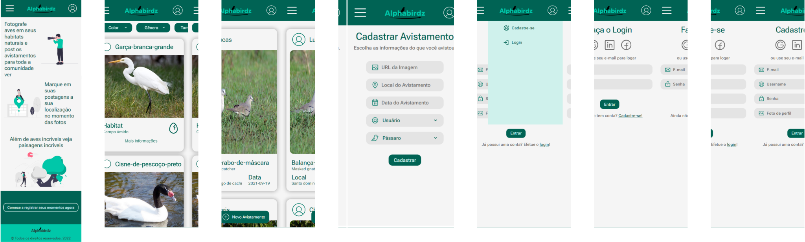

## Alphabirdz
### iniciando o projeto Spring

Considerando que já tenha instalados o gerenciador de dependências Gradle, e alguma versão do java SDK.

#

- Clone o repositório.
```
git clone https://gitlab.com/alphabirdz/alphabirdz-angular.git
```
- Entre no diretório.
```
cd alpabirdz-spring
```
- Inicie o servidor
```
./gradlew bootRun
```

#

# ALPHABIRDZ

Este é o servidor desenvolvido para o app Alphabirdz, uma aplicação relacionada a observação de pássaros.

Consiste em um sistema de publicação de avistamento de aves em seus habitats naturais onde além de ser possível fazer um post com o avistamento também é possível consultar um guia com varias aves e sua descrições.
#

### Tabelas do banco 

Incialmente como ficarão as tabelas juntamente com as classes java.



#

### iniciando o projeto Spring

Considerando que já tenha instalados o gerenciador de pacotes NPM, o Angular e o Angular CLI, siga os passos abaixo.

#

- Clone o repositório.
```
git clone https://gitlab.com/alphabirdz/alphabirdz-angular.git
```
- Entre no diretório.
```
cd alpabirdz-angular
cd alpabirdz
```
- Instale as dependencias necessarias.
```
npm install
```
- Inicie o servidor
```
ng serve
```

#

## Projeto Alphabirdz
É um cliente desenvolvido com o framework Angular em TS, que faz o consumo de uma API desenvolvida em java.
O propósito é q seja possivel cadastrar avistamentos de aves, indicando qual ave, onde e quando ela foi avistada, também será possível consultar um banco de dados de pássaros, que contenha nomes, habitats, cores predominantes, entre outras características.

#

## Interface / Protótipo
#### Design esperado


#

## Autores

- [Ariel Q.](https://gitlab.com/quaresmina)
- [Jullie P.](https://gitlab.com/julliepx)
- [Kalebe N.](https://gitlab.com/kalNascimento)

#

